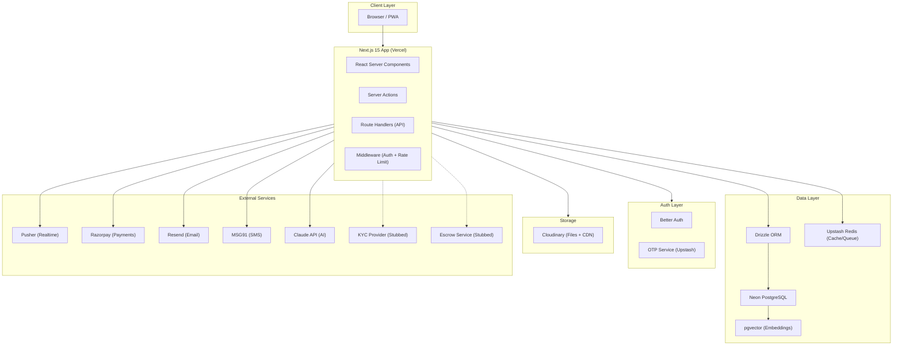
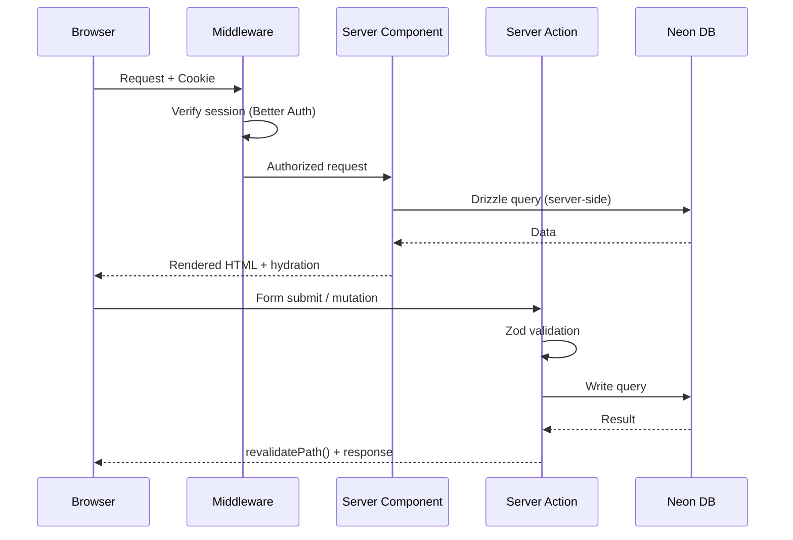
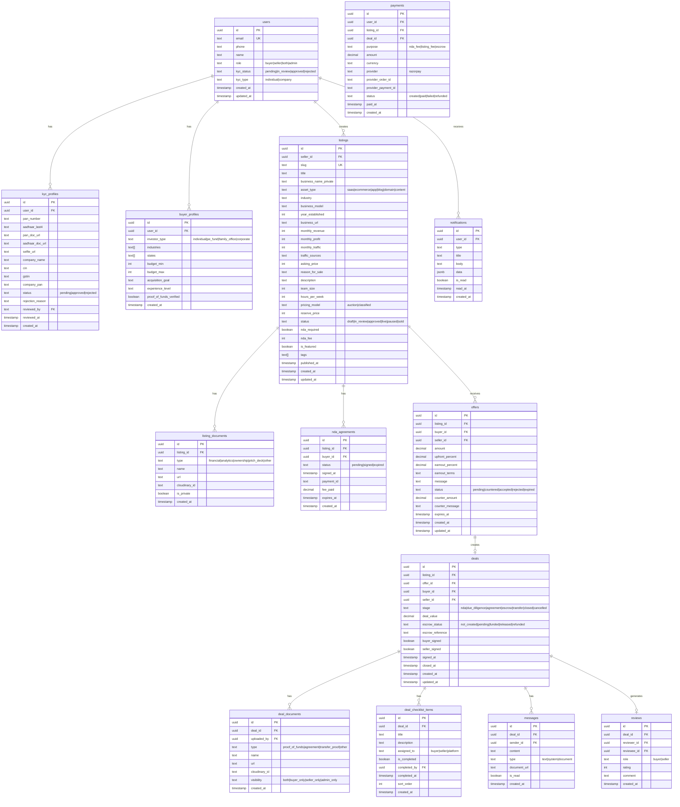
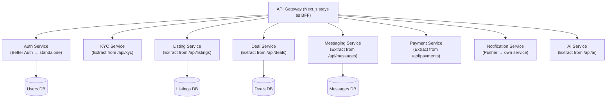

# FMI — Indian Digital Business Marketplace
## Production-Ready MVP Architecture & Implementation Plan
### 24-Hour AI-Assisted Build Guide

---

## 1. Product Vision

**FMI (Flippa for Modern India)** is a trust-first digital business marketplace purpose-built for the Indian ecosystem. It connects verified Indian business sellers with qualified buyers through a structured, compliance-oriented transaction workflow that covers KYC, NDA, due diligence, escrow, and secure asset transfer.

### Core Value Proposition

| Problem | FMI Solution |
|---|---|
| No standardized Indian marketplace workflow | Step-by-step role-based buyer/seller journeys |
| Fake listings, fraudulent buyers | Mandatory PAN + Aadhaar + GST verification |
| No trust layer between parties | NDA gating, KYC walls, escrow protection |
| Unstructured deal negotiations | Deal Room with structured checklists and timelines |
| Manual document handling | Automated document vault with watermarking |

### Target Users

- **Sellers**: Indian SME owners, SaaS founders, eCommerce operators, domain holders, app developers
- **Buyers**: Individual investors, PE funds, Family offices, Corporate acquirers, HNIs
- **Admin**: Platform moderators, KYC reviewers, deal managers

---

## 2. MVP Scope (24-Hour Build)

### What Gets Built Today

```
✅ Landing page (investor-demo quality)
✅ Authentication (Email OTP + Phone OTP)
✅ Role selection (Buyer / Seller / Both)
✅ KYC onboarding wizard (Individual + Company path)
✅ Seller listing wizard (multi-step)
✅ Listing marketplace (search + filter + grid)
✅ Listing detail page (gated behind NDA)
✅ NDA signing flow (digital consent)
✅ Deal Room (workspace per deal)
✅ Offer management (create/accept/counter/reject)
✅ Secure messaging (per deal)
✅ Document vault (upload + view)
✅ Admin panel (listing review, KYC approval, deal monitoring)
✅ Buyer dashboard
✅ Seller dashboard
✅ Notification system (in-app)
```

### What Gets Stubbed

> Detailed in Section 3

---

## 2a. User Journeys Summary

### Buyer Journey (46 Steps → MVP: 20 Core Steps)

```
Visit → Signup → Email OTP → Profile → Phone OTP →
Buyer Type (Individual/Company) → KYC (PAN + Aadhaar + Selfie) →
KYC Approved → Dashboard → Browse Listings →
Click Listing → Pay NDA Fee → Sign NDA → View Financials →
Contact Seller → Make Offer → Deal Room →
Upload Proof of Funds → Escrow → Due Diligence →
E-sign Agreement → Confirm Handover → Deal Closed
```

### Seller Journey (71 Steps → MVP: 25 Core Steps)

```
Visit → Signup → Email OTP → Profile → Phone OTP →
Seller Type → KYC (PAN + Aadhaar + Selfie + Bank) →
KYC Approved → Dashboard → Create Listing →
Asset Type → Title + Industry + Revenue + Profit →
Upload Proofs → Submit for Review →
Moderation Approved → Listing Live →
Receive NDA Requests → Chat with Buyers →
Receive Offer → Accept/Counter → Deal Room →
Upload Detailed Financials → E-sign Agreement →
Transfer Assets → Escrow Released → Deal Closed
```

---

## 3. Features to Stub

### Phase 1 → Stub These on Day 1

| Feature | Stub Strategy | Why |
|---|---|---|
| **KYC Provider (DigiLocker/SumSub)** | Mock approval after form submit, auto-approve in dev | Integration takes 3–5 days to set up; UI flow is identical |
| **Escrow Service** | Fake escrow status, webhook simulation | Real escrow requires RBI compliance & legal setup |
| **PAN Verification API** | Validate format only (ABCDE1234F), skip real API | Sandbox credentials take days |
| **Aadhaar OCR** | Accept any image upload, show "processing" | DigiLocker OAuth is complex |
| **GST Portal Validation** | Regex format check only | API access is restricted |
| **Google Analytics OAuth** | Upload screenshot instead | OAuth app review takes time |
| **Payment Processor (Razorpay)** | Use Razorpay test mode with ₹1 transactions | Test mode is instant |
| **SMS OTP (MSG91)** | Log OTP to console / hardcode "123456" in dev | Avoids per-SMS cost in dev |
| **Document Watermarking** | CSS-based overlay watermark | Real PDF watermarking is overkill for demo |
| **AI Recommendation Engine** | Return random 5 listings tagged "Recommended" | True ML needs weeks of data |
| **Liveness Check (Selfie)** | Accept any photo, skip liveness detection | FaceTec/iProov needs contract |
| **E-signature Provider** | Checkbox + timestamp stored as "signed" | DigiSigner/DocuSign setup is slow |
| **CIN Verification** | Format check only (U12345MH2020PTC123456) | MCA21 API access requires registration |

---

## 4. Recommended Tech Stack

### Frontend

| Technology | Choice | Reason |
|---|---|---|
| Framework | **Next.js 15 (App Router)** | Best AI codegen support, RSC + Server Actions, zero config |
| Language | **TypeScript** | Type safety = fewer AI agent bugs |
| UI Library | **shadcn/ui** | Copy-paste components, Radix primitives, no lock-in |
| Styling | **Tailwind CSS v4** | AI agents write Tailwind perfectly |
| Animation | **Framer Motion** | Polished transitions with minimal code |
| Icons | **Lucide React** | shadcn-native, consistent, tree-shakeable |
| Forms | **React Hook Form + Zod** | Best DX, validation colocated with schema |
| Data Fetching | **TanStack Query** | Cache + optimistic updates + devtools |
| State | **Zustand** | Minimal boilerplate, AI-friendly |

### ORM: Drizzle vs Prisma

**Winner: Drizzle ORM**

| Criteria | Prisma | Drizzle |
|---|---|---|
| AI codegen accuracy | ✅ Excellent | ✅ Excellent |
| Type safety | ✅ | ✅ Better (runtime types from schema) |
| Migration speed | Schema push is fast | `drizzle-kit push` is instant |
| Bundle size | Heavy (query engine) | Tiny, no binary |
| SQL proximity | Abstracted | SQL-like → easier to reason about |
| Edge runtime | ❌ Issues | ✅ Native |

> **Decision**: Use **Drizzle** for this build. It's lighter, edge-compatible, and produces schemas that AI agents read more naturally as they resemble SQL directly.

### Authentication

**Winner: Better Auth**

| Criteria | Clerk | Auth.js | Better Auth |
|---|---|---|---|
| Self-hosted | ❌ | ✅ | ✅ |
| India compliance (data residency) | ❌ Risky | ✅ | ✅ |
| Email OTP | ✅ | Plugin | ✅ Built-in |
| Phone OTP | ✅ | Manual | ✅ Built-in |
| Custom roles | Paid | Manual | ✅ Built-in |
| Setup time | 10 min | 30 min | 20 min |
| Cost | $25+/mo | Free | Free |

> **Decision**: **Better Auth** — supports email OTP, phone OTP, custom roles, is self-hosted (India data compliance), and has an excellent DX. Clerk is too expensive and US-data-resident for an Indian platform.

### Database

**PostgreSQL on Neon** (serverless, autoscales, free tier, instant provisioning)

### File Storage

**Cloudinary**

- Instant setup (API key only)
- Built-in image transforms, watermarking, and OCR
- Generous free tier
- AI agents generate Cloudinary upload code perfectly

> Alternative: Supabase Storage if using Supabase for database too. For this stack with Neon + Drizzle, Cloudinary is faster.

### Realtime

**Pusher** (Channels)

- 5-minute setup
- Free tier (200k messages/day)
- Perfect for: deal room notifications, chat messages, KYC status updates
- AI agents know Pusher client/server code extremely well

### Payments

**Razorpay**

- India-first, UPI native
- Test mode works without KYC
- Supports: UPI, Cards, Net Banking, Wallets
- Use for: NDA unlock fee, listing fee, escrow simulation

### Emails

**Resend + React Email**

- Send transactional emails with React components
- 100 emails/day free
- Use for: OTP, deal notifications, KYC status, offer alerts

### SMS

**MSG91** (stub in dev, activate in production)

- India-focused, DLT-registered templates
- In dev: log OTP to console, use hardcoded "123456"

### Deployment

| Layer | Service | Reason |
|---|---|---|
| Frontend + Backend | **Vercel** | Zero-config Next.js, instant deploys, Edge runtime |
| Database | **Neon** | Serverless Postgres, autoscales, free tier |
| File Storage | **Cloudinary** | CDN included, no config |
| CDN | **Vercel Edge Network** | Included with Vercel |
| KV / Cache | **Upstash Redis** | Serverless Redis for rate limiting, OTP storage |

### AI Services

| Purpose | Service | Reason |
|---|---|---|
| LLM (chat, analysis) | **Claude claude-sonnet-4-6 via API** | Best reasoning, Indian context |
| OCR | **Cloudinary OCR** | Already in stack |
| Embeddings | **OpenAI text-embedding-3-small** | Cheap, fast |
| Document Analysis | **Claude API with PDF** | Native PDF understanding |
| Moderation | **OpenAI Moderation API** | Free, instant |
| Recommendation | **pgvector + Drizzle** | Semantic search on listing embeddings |

---

## 5. High-Level Architecture



### Request Flow



---

## 6. Folder Structure

```
fmi/
├── app/                              # Next.js App Router
│   ├── (marketing)/                  # Public marketing pages
│   │   ├── page.tsx                  # Landing page
│   │   ├── about/page.tsx
│   │   └── how-it-works/page.tsx
│   │
│   ├── (auth)/                       # Auth pages (no sidebar)
│   │   ├── login/page.tsx
│   │   ├── signup/page.tsx
│   │   ├── verify-email/page.tsx
│   │   └── verify-phone/page.tsx
│   │
│   ├── (onboarding)/                 # Post-auth onboarding
│   │   ├── role/page.tsx             # Buyer / Seller / Both
│   │   ├── kyc/
│   │   │   ├── individual/page.tsx
│   │   │   └── company/page.tsx
│   │   └── interests/page.tsx        # Buyer preferences
│   │
│   ├── (buyer)/                      # Buyer portal
│   │   ├── layout.tsx                # Buyer sidebar layout
│   │   ├── dashboard/page.tsx
│   │   ├── listings/
│   │   │   ├── page.tsx              # Browse marketplace
│   │   │   └── [slug]/page.tsx       # Listing detail
│   │   ├── deals/
│   │   │   ├── page.tsx
│   │   │   └── [dealId]/
│   │   │       ├── page.tsx          # Deal room
│   │   │       ├── documents/page.tsx
│   │   │       ├── messages/page.tsx
│   │   │       └── checklist/page.tsx
│   │   ├── offers/page.tsx
│   │   └── settings/page.tsx
│   │
│   ├── (seller)/                     # Seller portal
│   │   ├── layout.tsx
│   │   ├── dashboard/page.tsx
│   │   ├── listings/
│   │   │   ├── page.tsx
│   │   │   ├── new/page.tsx          # Listing wizard
│   │   │   └── [listingId]/
│   │   │       ├── page.tsx
│   │   │       └── edit/page.tsx
│   │   ├── deals/
│   │   │   ├── page.tsx
│   │   │   └── [dealId]/page.tsx
│   │   ├── offers/page.tsx
│   │   └── settings/page.tsx
│   │
│   ├── (admin)/                      # Admin panel
│   │   ├── layout.tsx
│   │   ├── dashboard/page.tsx
│   │   ├── listings/page.tsx         # Moderation queue
│   │   ├── kyc/page.tsx              # KYC review queue
│   │   ├── deals/page.tsx
│   │   ├── users/page.tsx
│   │   └── reports/page.tsx
│   │
│   └── api/                          # Route Handlers
│       ├── auth/[...all]/route.ts    # Better Auth handler
│       ├── listings/route.ts
│       ├── listings/[id]/route.ts
│       ├── offers/route.ts
│       ├── deals/route.ts
│       ├── messages/route.ts
│       ├── documents/route.ts
│       ├── kyc/route.ts
│       ├── payments/route.ts
│       ├── webhooks/
│       │   ├── razorpay/route.ts
│       │   ├── pusher/route.ts
│       │   └── kyc/route.ts
│       └── ai/
│           ├── recommend/route.ts
│           └── analyze/route.ts
│
├── components/
│   ├── ui/                           # shadcn/ui base components
│   ├── layout/
│   │   ├── sidebar-buyer.tsx
│   │   ├── sidebar-seller.tsx
│   │   ├── sidebar-admin.tsx
│   │   ├── navbar.tsx
│   │   ├── mobile-nav.tsx
│   │   └── page-header.tsx
│   ├── auth/
│   │   ├── login-form.tsx
│   │   ├── signup-form.tsx
│   │   ├── otp-input.tsx
│   │   └── role-selector.tsx
│   ├── kyc/
│   │   ├── kyc-wizard.tsx
│   │   ├── pan-input.tsx
│   │   ├── aadhaar-upload.tsx
│   │   ├── selfie-capture.tsx
│   │   ├── kyc-status-badge.tsx
│   │   └── company-kyc-form.tsx
│   ├── listings/
│   │   ├── listing-card.tsx
│   │   ├── listing-grid.tsx
│   │   ├── listing-wizard.tsx
│   │   ├── listing-detail.tsx
│   │   ├── listing-filters.tsx
│   │   ├── listing-search.tsx
│   │   ├── metrics-bar.tsx
│   │   └── asset-type-badge.tsx
│   ├── deal-room/
│   │   ├── deal-room-layout.tsx
│   │   ├── offer-card.tsx
│   │   ├── offer-form.tsx
│   │   ├── deal-timeline.tsx
│   │   ├── deal-checklist.tsx
│   │   ├── escrow-status.tsx
│   │   └── deal-stage-badge.tsx
│   ├── messaging/
│   │   ├── chat-window.tsx
│   │   ├── message-bubble.tsx
│   │   ├── message-input.tsx
│   │   └── typing-indicator.tsx
│   ├── documents/
│   │   ├── document-vault.tsx
│   │   ├── document-upload.tsx
│   │   ├── document-viewer.tsx
│   │   ├── nda-modal.tsx
│   │   └── watermarked-doc.tsx
│   ├── admin/
│   │   ├── review-queue.tsx
│   │   ├── kyc-review-card.tsx
│   │   ├── listing-review-card.tsx
│   │   └── admin-stats.tsx
│   └── shared/
│       ├── status-badge.tsx
│       ├── activity-feed.tsx
│       ├── notification-bell.tsx
│       ├── empty-state.tsx
│       ├── loading-skeleton.tsx
│       ├── stepper.tsx
│       ├── file-dropzone.tsx
│       ├── data-table.tsx
│       ├── metrics-card.tsx
│       └── confirm-dialog.tsx
│
├── lib/
│   ├── auth.ts                       # Better Auth config
│   ├── db/
│   │   ├── index.ts                  # Drizzle client
│   │   └── schema.ts                 # All table definitions
│   ├── cloudinary.ts
│   ├── pusher.ts
│   ├── razorpay.ts
│   ├── resend.ts
│   ├── redis.ts
│   ├── ai.ts                         # Claude + OpenAI clients
│   └── utils.ts
│
├── actions/                          # Server Actions
│   ├── auth.ts
│   ├── listings.ts
│   ├── offers.ts
│   ├── deals.ts
│   ├── messages.ts
│   ├── documents.ts
│   ├── kyc.ts
│   └── admin.ts
│
├── hooks/
│   ├── use-auth.ts
│   ├── use-listings.ts
│   ├── use-deal.ts
│   ├── use-messages.ts
│   ├── use-pusher.ts
│   └── use-notifications.ts
│
├── store/
│   ├── auth-store.ts
│   ├── listing-wizard-store.ts
│   └── notification-store.ts
│
├── types/
│   ├── index.ts
│   ├── listing.ts
│   ├── deal.ts
│   ├── user.ts
│   └── kyc.ts
│
├── config/
│   ├── site.ts
│   ├── nav.ts
│   └── constants.ts
│
├── emails/                           # React Email templates
│   ├── otp.tsx
│   ├── kyc-approved.tsx
│   ├── listing-approved.tsx
│   ├── new-offer.tsx
│   └── deal-closed.tsx
│
├── drizzle.config.ts
├── middleware.ts
├── next.config.ts
└── tailwind.config.ts
```

---

## 7. Database Design



### Complete Drizzle Schema

```typescript
// lib/db/schema.ts

import { pgTable, uuid, text, integer, decimal, boolean, timestamp, jsonb } from 'drizzle-orm/pg-core'
import { relations } from 'drizzle-orm'

export const users = pgTable('users', {
  id: uuid('id').primaryKey().defaultRandom(),
  email: text('email').unique().notNull(),
  emailVerified: boolean('email_verified').default(false),
  phone: text('phone').unique(),
  phoneVerified: boolean('phone_verified').default(false),
  name: text('name').notNull(),
  avatarUrl: text('avatar_url'),
  role: text('role', { enum: ['buyer', 'seller', 'both', 'admin'] }).default('buyer'),
  kycStatus: text('kyc_status', { enum: ['not_started', 'pending', 'in_review', 'approved', 'rejected'] }).default('not_started'),
  kycType: text('kyc_type', { enum: ['individual', 'company'] }),
  createdAt: timestamp('created_at').defaultNow(),
  updatedAt: timestamp('updated_at').defaultNow(),
})

export const kycProfiles = pgTable('kyc_profiles', {
  id: uuid('id').primaryKey().defaultRandom(),
  userId: uuid('user_id').references(() => users.id).notNull(),
  panNumber: text('pan_number'),
  aadhaarLast4: text('aadhaar_last4'),
  panDocUrl: text('pan_doc_url'),
  aadhaarDocUrl: text('aadhaar_doc_url'),
  selfieUrl: text('selfie_url'),
  bankAccountName: text('bank_account_name'),
  bankAccountNumber: text('bank_account_number'),
  bankIfsc: text('bank_ifsc'),
  companyName: text('company_name'),
  cin: text('cin'),
  gstin: text('gstin'),
  companyPan: text('company_pan'),
  directorName: text('director_name'),
  status: text('status', { enum: ['pending', 'in_review', 'approved', 'rejected'] }).default('pending'),
  rejectionReason: text('rejection_reason'),
  reviewedBy: uuid('reviewed_by').references(() => users.id),
  reviewedAt: timestamp('reviewed_at'),
  createdAt: timestamp('created_at').defaultNow(),
})

export const buyerProfiles = pgTable('buyer_profiles', {
  id: uuid('id').primaryKey().defaultRandom(),
  userId: uuid('user_id').references(() => users.id).notNull(),
  investorType: text('investor_type', { enum: ['individual', 'pe_fund', 'family_office', 'corporate'] }),
  industries: text('industries').array(),
  states: text('states').array(),
  budgetMin: integer('budget_min'),
  budgetMax: integer('budget_max'),
  acquisitionGoal: text('acquisition_goal'),
  experienceLevel: text('experience_level', { enum: ['first_time', 'some', 'experienced', 'serial'] }),
  proofOfFundsVerified: boolean('proof_of_funds_verified').default(false),
  createdAt: timestamp('created_at').defaultNow(),
})

export const listings = pgTable('listings', {
  id: uuid('id').primaryKey().defaultRandom(),
  sellerId: uuid('seller_id').references(() => users.id).notNull(),
  slug: text('slug').unique(),
  title: text('title').notNull(),
  businessNamePrivate: text('business_name_private'),
  assetType: text('asset_type', { enum: ['saas', 'ecommerce', 'app', 'blog', 'domain', 'content_site', 'service'] }).notNull(),
  industry: text('industry').notNull(),
  businessModel: text('business_model'),
  yearEstablished: integer('year_established'),
  businessUrl: text('business_url'),
  monthlyRevenue: integer('monthly_revenue'),
  monthlyProfit: integer('monthly_profit'),
  monthlyTraffic: integer('monthly_traffic'),
  trafficSources: text('traffic_sources'),
  askingPrice: integer('asking_price').notNull(),
  reasonForSale: text('reason_for_sale'),
  description: text('description'),
  tagline: text('tagline'),
  teamSize: integer('team_size'),
  hoursPerWeek: integer('hours_per_week'),
  pricingModel: text('pricing_model', { enum: ['auction', 'classified'] }).default('classified'),
  reservePrice: integer('reserve_price'),
  status: text('status', { enum: ['draft', 'in_review', 'approved', 'live', 'paused', 'sold', 'rejected'] }).default('draft'),
  ndaRequired: boolean('nda_required').default(true),
  ndaFee: integer('nda_fee').default(0),
  isFeatured: boolean('is_featured').default(false),
  coverImageUrl: text('cover_image_url'),
  tags: text('tags').array(),
  viewCount: integer('view_count').default(0),
  publishedAt: timestamp('published_at'),
  createdAt: timestamp('created_at').defaultNow(),
  updatedAt: timestamp('updated_at').defaultNow(),
})

export const listingDocuments = pgTable('listing_documents', {
  id: uuid('id').primaryKey().defaultRandom(),
  listingId: uuid('listing_id').references(() => listings.id).notNull(),
  type: text('type', { enum: ['financial', 'analytics', 'ownership', 'pitch_deck', 'other'] }).notNull(),
  name: text('name').notNull(),
  url: text('url').notNull(),
  cloudinaryId: text('cloudinary_id'),
  isPrivate: boolean('is_private').default(true),
  createdAt: timestamp('created_at').defaultNow(),
})

export const ndaAgreements = pgTable('nda_agreements', {
  id: uuid('id').primaryKey().defaultRandom(),
  listingId: uuid('listing_id').references(() => listings.id).notNull(),
  buyerId: uuid('buyer_id').references(() => users.id).notNull(),
  status: text('status', { enum: ['pending', 'signed', 'expired'] }).default('pending'),
  signedAt: timestamp('signed_at'),
  paymentId: uuid('payment_id'),
  feePaid: decimal('fee_paid', { precision: 10, scale: 2 }),
  expiresAt: timestamp('expires_at'),
  createdAt: timestamp('created_at').defaultNow(),
})

export const offers = pgTable('offers', {
  id: uuid('id').primaryKey().defaultRandom(),
  listingId: uuid('listing_id').references(() => listings.id).notNull(),
  buyerId: uuid('buyer_id').references(() => users.id).notNull(),
  sellerId: uuid('seller_id').references(() => users.id).notNull(),
  amount: decimal('amount', { precision: 12, scale: 2 }).notNull(),
  upfrontPercent: decimal('upfront_percent', { precision: 5, scale: 2 }).default('100'),
  earnoutPercent: decimal('earnout_percent', { precision: 5, scale: 2 }).default('0'),
  earnoutTerms: text('earnout_terms'),
  message: text('message'),
  status: text('status', { enum: ['pending', 'countered', 'accepted', 'rejected', 'expired', 'withdrawn'] }).default('pending'),
  counterAmount: decimal('counter_amount', { precision: 12, scale: 2 }),
  counterMessage: text('counter_message'),
  expiresAt: timestamp('expires_at'),
  createdAt: timestamp('created_at').defaultNow(),
  updatedAt: timestamp('updated_at').defaultNow(),
})

export const deals = pgTable('deals', {
  id: uuid('id').primaryKey().defaultRandom(),
  listingId: uuid('listing_id').references(() => listings.id).notNull(),
  offerId: uuid('offer_id').references(() => offers.id).notNull(),
  buyerId: uuid('buyer_id').references(() => users.id).notNull(),
  sellerId: uuid('seller_id').references(() => users.id).notNull(),
  stage: text('stage', { enum: ['nda', 'due_diligence', 'agreement', 'escrow', 'transfer', 'closed', 'cancelled'] }).default('due_diligence'),
  dealValue: decimal('deal_value', { precision: 12, scale: 2 }),
  escrowStatus: text('escrow_status', { enum: ['not_created', 'pending', 'funded', 'released', 'refunded'] }).default('not_created'),
  escrowReference: text('escrow_reference'),
  buyerSigned: boolean('buyer_signed').default(false),
  sellerSigned: boolean('seller_signed').default(false),
  signedAt: timestamp('signed_at'),
  closedAt: timestamp('closed_at'),
  createdAt: timestamp('created_at').defaultNow(),
  updatedAt: timestamp('updated_at').defaultNow(),
})

export const dealDocuments = pgTable('deal_documents', {
  id: uuid('id').primaryKey().defaultRandom(),
  dealId: uuid('deal_id').references(() => deals.id).notNull(),
  uploadedBy: uuid('uploaded_by').references(() => users.id).notNull(),
  type: text('type', { enum: ['proof_of_funds', 'agreement', 'transfer_proof', 'nda', 'other'] }).notNull(),
  name: text('name').notNull(),
  url: text('url').notNull(),
  cloudinaryId: text('cloudinary_id'),
  visibility: text('visibility', { enum: ['both', 'buyer_only', 'seller_only', 'admin_only'] }).default('both'),
  createdAt: timestamp('created_at').defaultNow(),
})

export const dealChecklistItems = pgTable('deal_checklist_items', {
  id: uuid('id').primaryKey().defaultRandom(),
  dealId: uuid('deal_id').references(() => deals.id).notNull(),
  title: text('title').notNull(),
  description: text('description'),
  assignedTo: text('assigned_to', { enum: ['buyer', 'seller', 'platform'] }).notNull(),
  isCompleted: boolean('is_completed').default(false),
  completedBy: uuid('completed_by').references(() => users.id),
  completedAt: timestamp('completed_at'),
  sortOrder: integer('sort_order').default(0),
  createdAt: timestamp('created_at').defaultNow(),
})

export const messages = pgTable('messages', {
  id: uuid('id').primaryKey().defaultRandom(),
  dealId: uuid('deal_id').references(() => deals.id).notNull(),
  senderId: uuid('sender_id').references(() => users.id).notNull(),
  content: text('content').notNull(),
  type: text('type', { enum: ['text', 'system', 'document'] }).default('text'),
  documentUrl: text('document_url'),
  isRead: boolean('is_read').default(false),
  createdAt: timestamp('created_at').defaultNow(),
})

export const notifications = pgTable('notifications', {
  id: uuid('id').primaryKey().defaultRandom(),
  userId: uuid('user_id').references(() => users.id).notNull(),
  type: text('type').notNull(),
  title: text('title').notNull(),
  body: text('body'),
  data: jsonb('data'),
  isRead: boolean('is_read').default(false),
  readAt: timestamp('read_at'),
  createdAt: timestamp('created_at').defaultNow(),
})

export const payments = pgTable('payments', {
  id: uuid('id').primaryKey().defaultRandom(),
  userId: uuid('user_id').references(() => users.id).notNull(),
  listingId: uuid('listing_id').references(() => listings.id),
  dealId: uuid('deal_id').references(() => deals.id),
  purpose: text('purpose', { enum: ['nda_fee', 'listing_fee', 'escrow'] }).notNull(),
  amount: decimal('amount', { precision: 12, scale: 2 }).notNull(),
  currency: text('currency').default('INR'),
  provider: text('provider').default('razorpay'),
  providerOrderId: text('provider_order_id'),
  providerPaymentId: text('provider_payment_id'),
  status: text('status', { enum: ['created', 'paid', 'failed', 'refunded'] }).default('created'),
  paidAt: timestamp('paid_at'),
  createdAt: timestamp('created_at').defaultNow(),
})

export const reviews = pgTable('reviews', {
  id: uuid('id').primaryKey().defaultRandom(),
  dealId: uuid('deal_id').references(() => deals.id).notNull(),
  reviewerId: uuid('reviewer_id').references(() => users.id).notNull(),
  revieweeId: uuid('reviewee_id').references(() => users.id).notNull(),
  role: text('role', { enum: ['buyer', 'seller'] }).notNull(),
  rating: integer('rating').notNull(),
  comment: text('comment'),
  createdAt: timestamp('created_at').defaultNow(),
})
```

---

## 8. API Design

### Authentication `/api/auth/*`
Handled by Better Auth — auto-generates all endpoints.

### Listings

```
GET    /api/listings              → Browse marketplace (filters, search, pagination)
POST   /api/listings              → Create new listing (draft)
GET    /api/listings/:id          → Get listing detail
PUT    /api/listings/:id          → Update listing
DELETE /api/listings/:id          → Delete/archive listing
POST   /api/listings/:id/submit   → Submit for review
POST   /api/listings/:id/publish  → Admin: approve + publish
POST   /api/listings/:id/reject   → Admin: reject with reason
GET    /api/listings/:id/documents → Get listing docs (NDA-gated)
POST   /api/listings/:id/unlock   → Pay NDA fee + sign NDA
```

### Offers

```
GET    /api/offers                → Get all offers (buyer or seller view)
POST   /api/offers                → Submit new offer
GET    /api/offers/:id            → Get offer detail
POST   /api/offers/:id/accept     → Accept offer → creates deal
POST   /api/offers/:id/counter    → Counter with new amount
POST   /api/offers/:id/reject     → Reject offer
POST   /api/offers/:id/withdraw   → Buyer withdraws offer
```

### Deals

```
GET    /api/deals                 → List user's deals
GET    /api/deals/:id             → Deal room detail + stage
PUT    /api/deals/:id/stage       → Advance deal stage
POST   /api/deals/:id/sign        → E-sign agreement (stub)
POST   /api/deals/:id/escrow      → Create escrow (stub)
POST   /api/deals/:id/release     → Release escrow (dual approval)
POST   /api/deals/:id/close       → Mark deal closed
GET    /api/deals/:id/checklist   → Get checklist items
PUT    /api/deals/:id/checklist/:itemId → Complete checklist item
```

### Messages

```
GET    /api/messages/:dealId      → Get deal messages
POST   /api/messages/:dealId      → Send message
PUT    /api/messages/:dealId/read → Mark messages as read
```

### Documents

```
POST   /api/documents/upload      → Upload document to Cloudinary
GET    /api/documents/:id         → Get document (permission-checked)
DELETE /api/documents/:id         → Delete document
```

### KYC

```
POST   /api/kyc/submit            → Submit KYC documents
GET    /api/kyc/status            → Get current KYC status
POST   /api/kyc/:userId/approve   → Admin: approve KYC
POST   /api/kyc/:userId/reject    → Admin: reject KYC with reason
```

### Payments

```
POST   /api/payments/order        → Create Razorpay order
POST   /api/payments/verify       → Verify payment signature
GET    /api/payments/history      → User payment history
```

### Webhooks

```
POST   /api/webhooks/razorpay     → Handle payment events
POST   /api/webhooks/kyc          → Handle KYC provider callbacks
```

### AI

```
POST   /api/ai/recommend          → Get recommended listings for buyer
POST   /api/ai/analyze-listing    → Analyze listing quality (admin)
POST   /api/ai/valuation          → Suggest asking price
```

---

## 9. Module Breakdown (AI Agent Tasks)

Each module is independently buildable and deployable. Assign one AI agent per module.

---

### Agent 1: Project Setup + Infrastructure
**Time**: Hour 1–2

**Responsibility**: Bootstrap everything so other agents can work immediately.

```
Tasks:
- npx create-next-app@latest fmi --typescript --tailwind --app
- Install all dependencies
- Configure Drizzle + Neon connection
- Configure Better Auth
- Configure Cloudinary
- Configure Pusher
- Configure Resend
- Configure Razorpay
- Set up Upstash Redis
- Create .env.local with all keys
- Run drizzle-kit push to create all tables
- Deploy skeleton to Vercel
```

**Outputs**: Running Next.js app, all tables created, all services connected.

---

### Agent 2: Authentication + Onboarding
**Time**: Hour 2–4

**Responsibility**: Complete auth flow from landing to KYC.

```
Pages:
- /login (email + Google)
- /signup
- /verify-email (OTP)
- /verify-phone (OTP)
- /onboarding/role (Buyer / Seller / Both)
- /onboarding/kyc/individual
- /onboarding/kyc/company

Components:
- login-form.tsx
- signup-form.tsx
- otp-input.tsx (6-digit animated)
- role-selector.tsx (cards with icons)
- kyc-wizard.tsx (multi-step)
- pan-input.tsx (format validation)
- aadhaar-upload.tsx
- selfie-capture.tsx

Server Actions:
- sendEmailOtp(), verifyEmailOtp()
- sendPhoneOtp(), verifyPhoneOtp()
- submitKyc(), getKycStatus()

Middleware:
- Redirect unauthenticated users
- Redirect unverified KYC for deal actions
```

---

### Agent 3: Listing Wizard (Seller Side)
**Time**: Hour 4–7

**Responsibility**: Multi-step listing creation flow.

```
Pages:
- /seller/listings/new (6-step wizard)

Steps:
1. Asset Type selection (card grid)
2. Basic info (title, industry, URL, year)
3. Financials (revenue, profit, expenses)
4. Traffic + proof uploads
5. Story (tagline, description, reason for sale)
6. Pricing + visibility settings

Components:
- listing-wizard.tsx (stepper + progress)
- asset-type-selector.tsx
- financial-input-group.tsx
- file-dropzone.tsx (multi-file)
- rich-text-editor.tsx (for description)
- pricing-config.tsx
- listing-preview.tsx

Store:
- listing-wizard-store.ts (Zustand, persist per step)

Server Actions:
- createListingDraft()
- updateListingStep()
- uploadListingDocument()
- submitListingForReview()
```

---

### Agent 4: Marketplace (Buyer Side)
**Time**: Hour 4–7 (parallel with Agent 3)

**Responsibility**: Browse, search, filter, and view listings.

```
Pages:
- /listings (marketplace grid)
- /listings/[slug] (listing detail)

Components:
- listing-card.tsx (revenue, profit, multiple, type badge)
- listing-grid.tsx (responsive grid + skeleton)
- listing-filters.tsx (sidebar: type, revenue range, price)
- listing-search.tsx (debounced search)
- listing-detail.tsx (full page with gated sections)
- metrics-bar.tsx (revenue, profit, multiple, traffic)
- nda-modal.tsx (sign NDA gate)
- contact-seller-button.tsx (KYC check)

API:
- GET /api/listings (with filters + full-text search)
- GET /api/listings/:id
- POST /api/listings/:id/unlock

Features:
- Filter by: asset type, revenue, asking price, industry, age
- Sort by: newest, revenue, price, multiple
- NDA gate for financial details
- KYC gate for contacting seller
```

---

### Agent 5: Offer Flow
**Time**: Hour 7–9

**Responsibility**: Offer creation, management, and negotiation.

```
Pages:
- /buyer/offers (offer list)
- /seller/offers (incoming offers)

Components:
- offer-card.tsx (amount, status, timeline, actions)
- offer-form.tsx (amount, structure, message)
- counter-offer-modal.tsx
- offer-timeline.tsx (bid history)

Server Actions:
- submitOffer()
- acceptOffer() → creates deal
- counterOffer()
- rejectOffer()

Notifications triggered:
- New offer → seller
- Offer accepted → buyer
- Counter offer → buyer
- Offer rejected → buyer
```

---

### Agent 6: Deal Room
**Time**: Hour 9–13

**Responsibility**: The core deal workspace after offer is accepted.

```
Pages:
- /buyer/deals/[id]
- /seller/deals/[id]

Sub-pages:
- Overview (stage progress + parties)
- Documents (vault)
- Messages (chat)
- Checklist (handover tasks)
- Agreement (e-sign stub)

Components:
- deal-room-layout.tsx
- deal-stage-progress.tsx (visual pipeline)
- deal-timeline.tsx (activity feed)
- deal-checklist.tsx (task list per party)
- escrow-status-card.tsx
- agreement-viewer.tsx
- e-sign-section.tsx (stub: checkbox = signed)
- deal-value-badge.tsx

Deal Stages:
due_diligence → agreement → escrow → transfer → closed

Auto-created checklist on deal creation:
BUYER: Upload proof of funds
BUYER: Complete due diligence review  
BUYER: Sign purchase agreement
BUYER: Fund escrow
BUYER: Confirm asset handover

SELLER: Upload detailed financials
SELLER: Grant analytics access
SELLER: Sign purchase agreement
SELLER: Transfer domain/assets
SELLER: Transfer code repositories
SELLER: Transfer admin accounts
```

---

### Agent 7: Messaging
**Time**: Hour 11–13 (parallel with Agent 6)

**Responsibility**: Real-time chat within deal rooms.

```
Components:
- chat-window.tsx
- message-list.tsx
- message-bubble.tsx (sender/receiver styling)
- message-input.tsx (with file attach)
- typing-indicator.tsx
- system-message.tsx (deal stage updates)

Realtime:
- Pusher channel: deal-{dealId}
- Events: new-message, user-typing, read-receipt

Server Actions:
- sendMessage()
- markMessagesRead()

Features:
- Optimistic UI updates
- Read receipts
- File sharing via Cloudinary
- System messages for stage changes
```

---

### Agent 8: Admin Panel
**Time**: Hour 13–16

**Responsibility**: Platform moderation and operations.

```
Pages:
- /admin/dashboard (KPIs: listings, deals, users, revenue)
- /admin/listings (review queue)
- /admin/kyc (KYC approval queue)
- /admin/deals (active deals monitor)
- /admin/users (user management)

Components:
- admin-stats-grid.tsx
- review-queue.tsx (listing cards with approve/reject)
- kyc-review-card.tsx (doc viewer + approve/reject)
- listing-review-modal.tsx
- user-table.tsx (searchable, filterable)
- deal-monitor-table.tsx

Server Actions:
- approveListing()
- rejectListing()
- approveKyc()
- rejectKyc()
- suspendUser()
- featuredListing()

Access: Admin role only (middleware check)
```

---

### Agent 9: Dashboards + Notifications
**Time**: Hour 16–18

**Responsibility**: Personalized dashboards and notification system.

```
Buyer Dashboard:
- Saved/recommended listings
- Active offers
- Active deals (stages)
- Recently viewed listings

Seller Dashboard:
- Listing performance (views, unlocks, offers)
- Active listings status
- Incoming offers
- Active deals (stages)

Notifications:
- Bell icon (unread count badge)
- Notification dropdown (last 10)
- Notification page (all history)
- Pusher push for real-time updates

Components:
- buyer-dashboard.tsx
- seller-dashboard.tsx
- metrics-card.tsx (animated numbers)
- recent-activity.tsx
- notification-bell.tsx
- notification-item.tsx
```

---

### Agent 10: UI Polish + Landing Page
**Time**: Hour 18–21

**Responsibility**: Landing page, empty states, loading skeletons, animations.

```
Landing Page Sections:
- Hero (headline + CTA + trust badges)
- How it works (3-step visual)
- Asset types (grid of categories)
- Stats (listings, deals closed, value transacted)
- Featured listings preview
- Testimonials (fake for demo)
- FAQ
- CTA footer

Reusable Polish:
- All skeleton loaders
- Empty state illustrations
- Error boundaries
- 404 page
- Loading states
- Toast notifications
- Framer Motion page transitions
- Responsive mobile layouts
```

---

## 10. UI Pages

### Public Pages

| Route | Description |
|---|---|
| `/` | Landing page |
| `/how-it-works` | Process explainer |
| `/listings` | Public marketplace |
| `/listings/[slug]` | Listing detail (gated) |
| `/about` | About FMI |

### Auth Pages

| Route | Description |
|---|---|
| `/login` | Login with email / Google |
| `/signup` | Create account |
| `/verify-email` | Email OTP verification |
| `/verify-phone` | Phone OTP verification |

### Onboarding Pages

| Route | Description |
|---|---|
| `/onboarding/role` | Choose role: Buyer/Seller/Both |
| `/onboarding/kyc/individual` | Individual KYC wizard |
| `/onboarding/kyc/company` | Company KYC wizard |
| `/onboarding/interests` | Buyer preferences (industries, budget) |

### Buyer Pages

| Route | Description |
|---|---|
| `/buyer/dashboard` | Buyer home |
| `/buyer/listings` | Saved + recommended |
| `/buyer/offers` | All offers made |
| `/buyer/deals` | Active deal rooms |
| `/buyer/deals/[id]` | Deal room |
| `/buyer/deals/[id]/documents` | Deal documents |
| `/buyer/deals/[id]/messages` | Deal chat |
| `/buyer/deals/[id]/checklist` | Handover checklist |
| `/buyer/settings` | Profile + preferences |

### Seller Pages

| Route | Description |
|---|---|
| `/seller/dashboard` | Seller home |
| `/seller/listings` | My listings |
| `/seller/listings/new` | Create listing wizard |
| `/seller/listings/[id]` | Listing detail + stats |
| `/seller/listings/[id]/edit` | Edit listing |
| `/seller/offers` | Incoming offers |
| `/seller/deals` | Active deal rooms |
| `/seller/deals/[id]` | Deal room |
| `/seller/settings` | Profile + bank details |

### Admin Pages

| Route | Description |
|---|---|
| `/admin/dashboard` | Platform KPIs |
| `/admin/listings` | Moderation queue |
| `/admin/kyc` | KYC review queue |
| `/admin/deals` | Deal monitor |
| `/admin/users` | User management |
| `/admin/reports` | Platform analytics |

---

## 11. UI Components

### Foundation Components (shadcn/ui base)
`Button`, `Input`, `Textarea`, `Select`, `Checkbox`, `RadioGroup`, `Switch`, `Tabs`, `Dialog`, `Sheet`, `Dropdown`, `Badge`, `Avatar`, `Card`, `Separator`, `Skeleton`, `Toast`, `Tooltip`, `Progress`, `ScrollArea`

### Custom Business Components

**Listings**
- `ListingCard` — cover image, title, type badge, revenue, multiple, asking price, NDA lock icon
- `ListingGrid` — responsive 3-col grid with skeleton loading
- `ListingFilters` — sidebar with multi-select filters
- `ListingSearch` — debounced search with suggestions
- `MetricsBar` — revenue / profit / multiple / traffic in a horizontal strip
- `AssetTypeBadge` — color-coded: SaaS (purple), eCommerce (blue), App (green), etc.
- `ListingStatusBadge` — Draft / In Review / Live / Sold

**Onboarding / KYC**
- `RoleSelector` — 3 large cards with icons (Buyer / Seller / Both)
- `KycWizard` — 4-step wizard with animated progress
- `PanInput` — masked input with format validation
- `AadhaarUpload` — dropzone with preview
- `SelfieCapture` — camera modal or upload fallback
- `KycStatusCard` — pending / approved / rejected state

**Deal Room**
- `DealStagePipeline` — horizontal stage tracker
- `OfferCard` — amount, structure, status, action buttons
- `OfferForm` — amount + earn-out + message
- `DealChecklist` — grouped by buyer/seller tasks
- `EscrowStatusCard` — amount, status, actions
- `AgreementViewer` — PDF-like contract preview
- `ESignSection` — checkbox + timestamp (stub)
- `DealTimeline` — chronological activity log

**Messaging**
- `ChatWindow` — full chat UI
- `MessageBubble` — sent/received variants
- `TypingIndicator` — animated dots
- `SystemMessage` — deal stage change notifications

**Admin**
- `ReviewQueue` — filterable card list
- `KycReviewCard` — split view: doc + approval controls
- `ListingReviewModal` — full listing preview + approve/reject
- `AdminStatsGrid` — 4 KPI cards with trend arrows
- `UserTable` — sortable data table with actions

**Shared**
- `Stepper` — multi-step wizard navigation
- `EmptyState` — illustration + heading + CTA
- `LoadingSkeleton` — per-component skeleton variants
- `StatusBadge` — universal status pill
- `ActivityFeed` — timestamped event list
- `NotificationBell` — unread badge + dropdown
- `FileDropzone` — drag-and-drop file upload
- `ConfirmDialog` — destructive action confirmation
- `DataTable` — TanStack Table with pagination
- `MetricsCard` — number + label + trend
- `PageHeader` — title + breadcrumb + actions

---

## 12. State Management

### Decision Matrix

| State Type | Where to Keep It | Why |
|---|---|---|
| Listings list (marketplace) | **Server Component + TanStack Query** | SEO + cache + real-time refetch |
| Listing detail page | **Server Component (RSC)** | SEO critical, static-ish |
| Auth session | **Better Auth session + Zustand** | Server: auth checks, Client: UI-driven |
| KYC wizard steps | **Zustand (persisted)** | Multi-step, browser refresh safe |
| Listing creation wizard | **Zustand (persisted)** | Multi-step, draft auto-save |
| Offer form | **React Hook Form (local)** | Single form, no sharing needed |
| Deal room data | **TanStack Query** | Polling + invalidation on Pusher events |
| Chat messages | **TanStack Query + Pusher** | Optimistic inserts + real-time |
| Notifications | **Zustand + Pusher** | Instant bell update |
| Admin filters | **URL search params** | Shareable, bookmarkable |

### Pattern Guide

```typescript
// ✅ Server Component (data fetch, no interactivity)
// app/(buyer)/listings/page.tsx
const listings = await db.select().from(listings).where(...)

// ✅ TanStack Query (interactive, refetchable)
// components/listings/listing-grid.tsx
const { data } = useQuery({ queryKey: ['listings', filters], queryFn: fetchListings })

// ✅ Server Action (mutations)
// actions/offers.ts
'use server'
export async function submitOffer(data: OfferInput) {
  await db.insert(offers).values(data)
  revalidatePath('/seller/offers')
}

// ✅ Zustand (wizard state)
// store/listing-wizard-store.ts
const useListingWizard = create(persist((set) => ({
  step: 1,
  data: {},
  setStep: (step) => set({ step }),
  updateData: (data) => set((state) => ({ data: { ...state.data, ...data } }))
}), { name: 'listing-wizard' }))
```

---

## 13. AI Opportunities

### Day 1 (Implement)

**1. AI Listing Quality Score**
On admin review, call Claude API with listing details → get a quality score + improvement suggestions.
```
Prompt: "Rate this business listing 1-10 for quality and buyer appeal. 
Point out red flags and suggest improvements. Return JSON."
```

**2. Suggested Asking Price**
When seller enters revenue + profit → Claude calculates a fair market multiple range.
```
Prompt: "Given: SaaS business, ₹5L MRR, ₹2L monthly profit, 3 years old. 
What is the fair valuation range using Indian SME multiples? Return JSON with min/max/recommendation."
```

**3. AI Listing Description Assistant**
Help sellers write a compelling listing description given their raw data.

### Phase 2 (Implement Later)

**4. Semantic Listing Search**
- Generate OpenAI embeddings for each listing at publish time
- Store in pgvector column
- Cosine similarity search for buyer queries like "profitable SaaS with recurring revenue under 50L"

**5. Buyer-Listing Match Score**
- Compare buyer profile (industries, budget, goal) against listings
- Score each listing for each buyer
- Drive "Recommended for You" section

**6. Due Diligence AI Assistant**
- Buyer uploads financial PDFs to deal room
- Claude analyzes and flags anomalies, calculates real EBITDA
- Generates DD question list for the seller

**7. Fraud Detection**
- Flag listings where revenue doesn't match uploaded screenshots
- Detect copy-paste from other platforms
- Score buyer POF documents for authenticity

**8. Contract Generation**
- Auto-populate SPA (Share Purchase Agreement) template with deal terms
- Indian law compliant (use standard SEBI/Companies Act language)
- Claude fills in parties, amounts, earn-out terms

---

## 14. Development Timeline (24-Hour Milestones)

```mermaid
gantt
    title FMI 24-Hour Build Plan
    dateFormat HH:mm
    axisFormat %H:%M

    section Setup
    Project init + deps install         :00:00, 30m
    Drizzle schema + DB migration       :00:30, 30m
    Better Auth config                  :01:00, 30m
    All service configs + .env          :01:30, 30m

    section Auth + Onboarding
    Login / Signup pages                :02:00, 60m
    Email + Phone OTP                   :03:00, 60m
    Role selector + KYC wizard          :04:00, 90m

    section Core Features
    Listing wizard (seller)             :05:30, 120m
    Marketplace + listing detail        :05:30, 120m

    section Deal Flow
    Offer submit + management           :07:30, 90m
    Deal room + stages                  :09:00, 120m
    Chat (Pusher)                       :11:00, 90m
    Document vault                      :12:30, 60m

    section Admin
    Admin dashboard                     :13:30, 60m
    KYC review queue                    :14:30, 60m
    Listing moderation                  :15:30, 60m

    section Dashboards
    Buyer dashboard                     :16:30, 60m
    Seller dashboard                    :17:30, 60m
    Notifications                       :18:30, 60m

    section Polish
    Landing page                        :19:30, 90m
    Empty states + skeletons            :21:00, 60m
    Mobile responsiveness               :22:00, 60m

    section Deploy
    Final testing                       :23:00, 30m
    Vercel deployment                   :23:30, 30m
```



### Hourly Breakdown

| Hours | Focus | Milestone |
|---|---|---|
| 0–2 | Setup + DB | Project running, all tables created |
| 2–4 | Auth + Onboarding | Login → KYC flow complete |
| 4–7 | Listing Wizard | Seller can create and submit a listing |
| 5–7 | Marketplace | Buyer can browse and view listings |
| 7–9 | Offer Flow | Buyer makes offer, seller responds |
| 9–13 | Deal Room | Full deal workspace + checklist |
| 11–13 | Chat | Real-time messaging in deal room |
| 13–16 | Admin Panel | Moderation + KYC approval |
| 16–19 | Dashboards + Notifications | Personalized home screens |
| 19–21 | Landing Page | Investor-demo quality homepage |
| 21–23 | Polish | Empty states, skeletons, animations |
| 23–24 | Deploy + Test | Live on Vercel |

---

## 15. Risks + Simplified Implementations

### What NOT to Build in One Day

| Feature | Risk | Simplified Approach |
|---|---|---|
| Real PAN/Aadhaar verification | API contracts, onboarding, costs | Format validate only; mock "KYC Approved" after 3 sec delay |
| Real escrow (NBFC licensed) | Requires RBI compliance, legal | Fake escrow status tracker; no real money moves |
| Real e-signatures (DigiSign) | DSC setup, certificate chain | Checkbox + timestamp stored in DB = "signed" |
| Real liveness detection | SDK integration, licensing | Accept any selfie photo |
| CIN verification (MCA21) | API registration required | Format regex only |
| GST portal check | Government API, registration | Format regex only |
| Email moderation AI | Complex pipeline | Flag keywords, basic moderation |
| Analytics OAuth integrations | OAuth app review | Upload screenshot instead |
| Full-text search with Postgres | Acceptable but needs tuning | `ILIKE` search on title + description |
| Production SMS (DLT templates) | India DLT registration | Hardcode OTP "123456" in dev |
| PDF watermarking (server-side) | Complex PDF manipulation | CSS overlay watermark on viewer |
| Audit trail / immutable logs | Complex append-only system | Simple notifications table serves as log |

### Architecture Risks

| Risk | Mitigation |
|---|---|
| Drizzle unfamiliarity | Use their interactive docs; schema is pure TS |
| Better Auth multi-role complexity | Keep roles simple: store in users.role column |
| Pusher rate limits on free tier | 200k messages/day = fine for demo |
| Cloudinary upload size limits | Set 10MB limit on client before upload |
| Next.js 15 App Router complexity | Keep mutations in Server Actions only |
| Neon cold start latency | Enable connection pooling + keep-alive pings |

---

## 16. Future Architecture (MVP → Enterprise)

### Phase 2: Scale-Ready Additions (Month 2–3)

```
✅ Real KYC: SumSub / Hyperverge integration
✅ Real Escrow: Escrowpay India or licensed NBFC partner
✅ Real E-signatures: eMudhra DSC integration (legally valid in India)
✅ SMS: MSG91 with DLT-registered templates
✅ PAN/Aadhaar: Razorpay Route or NSDL API
✅ GST: Masters India API
✅ Advanced Search: pgvector + OpenAI embeddings
✅ Email Campaigns: Resend broadcast for inactive buyers
✅ Analytics: PostHog self-hosted
✅ Audit logs: Append-only event store
```

### Phase 3: Microservices Extraction (Month 4–6)

The modular monolith structure makes this clean to extract:



### Why This Works Without Rewriting

1. **Route Handlers → Microservice**: Each `/api/[module]/route.ts` maps 1:1 to a microservice endpoint. Extract, add service URL env var, done.

2. **Server Actions → Thin wrappers**: Server Actions call the same functions as Route Handlers. When extracting to services, just swap the direct DB call for an HTTP call.

3. **Drizzle schemas are portable**: Each service gets its own Drizzle schema slice. No ORM migration needed.

4. **Pusher → Self-hosted Socket.io**: Replace Pusher client with Socket.io. API is nearly identical.

5. **Zustand stores are frontend-only**: No backend changes when extracting microservices.

### Phase 4: Enterprise Features (Month 6+)

```
✅ White-label marketplace for brokers
✅ Broker / M&A advisor accounts with deal commission tracking
✅ SEBI-compliant equity investment flows (equity marketplace)
✅ Document translation (Hindi + regional languages)
✅ Mobile app (React Native / Expo sharing logic from Next.js)
✅ API for brokers and aggregators
✅ Advanced fraud ML model trained on FMI deal data
✅ Secure data room with expiring access tokens
✅ Video call integration (deal room)
✅ Seller CIM (Confidential Information Memorandum) AI generator
```

---

## Appendix A: Environment Variables

```bash
# Database
DATABASE_URL=postgresql://...@neon.tech/fmi

# Auth
BETTER_AUTH_SECRET=
BETTER_AUTH_URL=https://fmi.vercel.app
GOOGLE_CLIENT_ID=
GOOGLE_CLIENT_SECRET=

# Storage
CLOUDINARY_CLOUD_NAME=
CLOUDINARY_API_KEY=
CLOUDINARY_API_SECRET=

# Realtime
PUSHER_APP_ID=
PUSHER_KEY=
PUSHER_SECRET=
PUSHER_CLUSTER=ap2
NEXT_PUBLIC_PUSHER_KEY=
NEXT_PUBLIC_PUSHER_CLUSTER=ap2

# Payments
RAZORPAY_KEY_ID=
RAZORPAY_KEY_SECRET=
NEXT_PUBLIC_RAZORPAY_KEY_ID=

# Email
RESEND_API_KEY=
EMAIL_FROM=noreply@fmi.in

# SMS (stub in dev)
MSG91_AUTH_KEY=
MSG91_TEMPLATE_ID=

# Cache
UPSTASH_REDIS_REST_URL=
UPSTASH_REDIS_REST_TOKEN=

# AI
ANTHROPIC_API_KEY=
OPENAI_API_KEY=

# App
NEXT_PUBLIC_APP_URL=https://fmi.vercel.app
NODE_ENV=development
```

---

## Appendix B: Key Commands

```bash
# Setup
npx create-next-app@latest fmi --typescript --tailwind --app --src-dir=false
cd fmi

# Install dependencies
npm install drizzle-orm @neondatabase/serverless drizzle-kit
npm install better-auth
npm install @tanstack/react-query zustand
npm install react-hook-form @hookform/resolvers zod
npm install framer-motion lucide-react
npm install pusher pusher-js
npm install razorpay
npm install resend @react-email/components
npm install cloudinary
npm install @upstash/redis
npm install @anthropic-ai/sdk openai

# shadcn/ui
npx shadcn@latest init
npx shadcn@latest add button card input dialog sheet badge avatar tabs

# Database
npx drizzle-kit push        # Push schema to Neon
npx drizzle-kit generate    # Generate migrations
npx drizzle-kit studio      # Visual DB browser

# Dev
npm run dev

# Deploy
npx vercel --prod
```

---

*Generated for FMI — Indian Digital Business Marketplace*  
*Architecture optimized for 24-hour AI-assisted MVP build*  
*Version 1.0 | Ready for AI agent implementation*
